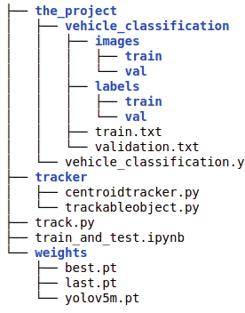

# Vehicle tracking and counting

## How to train

I am using Data which i uploaded on kaggle, it is preprocessed,and formatted according yolov5 documentation.you can download it [here](https://www.kaggle.com/billiemage/vehicle-detection).

Clone the project from github:=

    git clone https://github.com/Justsubh01/vehicle_tracking_and_counting.git

**Project structure should be like below tree**

## After doing this open the **train_and_test.ipynb** and run the code cell of it.
